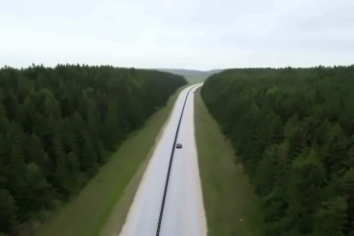
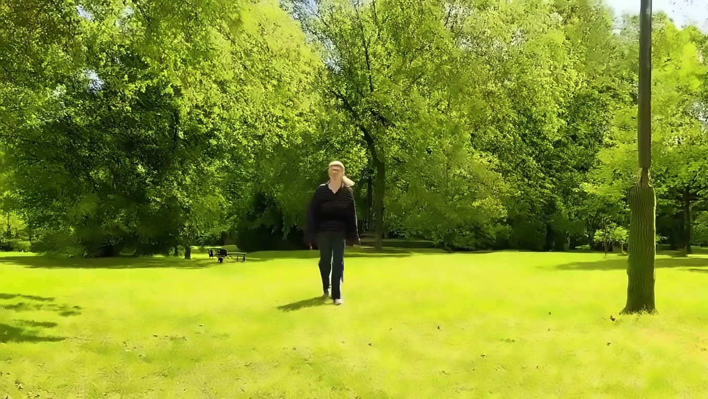

# CogVideoX Video Generation Benchmark

**Author**: Roan Guilherme Weigert Salgueiro

This experiment evaluates the CogVideoX family of models (2B, 5B, and 1.5-5B) for local GPU-based video generation, measuring computational efficiency, cost, and quality metrics for comparison with cloud-based alternatives.

## 🎯 Experiment Completed Successfully

**Status**: ✅ All 45 videos generated successfully  
**Date**: January 2026  
**Total Videos**: 45 (3 models × 3 prompts × 5 runs)  
**Success Rate**: 100% (45/45 videos)

## 📊 Key Results

### Performance Metrics by Model

| Model | Avg Time (s) | CLIP Score | Consistency | Total Cost | Videos |
|-------|-------------|------------|-------------|------------|--------|
| **CogVideoX-5b** | 611.11 ± 1.76 | 32.20 ± 2.42 | 0.563 ± 0.218 | $3.00 | 15 |
| **CogVideoX-2b** | 257.90 ± 0.43 | 30.90 ± 1.91 | 0.542 ± 0.193 | $1.27 | 15 |
| **CogVideoX1.5-5B** | 1762.35 ± 1.67 | 32.40 ± 2.85 | 0.424 ± 0.135 | $8.66 | 15 |

### Key Findings
- **Fastest Model**: CogVideoX-2b (257.90s avg, ~4.3 minutes per video)
- **Best Quality**: CogVideoX1.5-5B (CLIP: 32.40, highest text-video alignment)
- **Most Consistent**: CogVideoX-5b (0.563 frame consistency)
- **Most Cost-Efficient**: CogVideoX-2b ($0.08 per video)

## Overview

- **Models**: 3 CogVideoX variants (2B, 5B, 1.5-5B parameters)
- **Hardware**: Local GPU (NVIDIA with 12GB+ VRAM)
- **Prompts**: 3 standardized prompts
- **Runs per prompt**: 5 (N=5 for statistical validity)
- **Total videos**: 45
- **Video specs**: 49-81 frames, 720p-1080p resolution
- **GPU Cost**: $1.18/hour (based on power consumption)

## 🎬 Generated Videos Showcase

Click on any image to view the full video file. Showing first 3 runs for each model/prompt combination.

### CogVideoX-5b (5 Billion Parameters)

#### Prompt 1: "A person walking in a park on a sunny day"

<table>
  <tr>
    <td align="center">
      <a href="output_videos/CogVideoX-5b/prompt_1/run_1.mp4">
        
      </a><br/>
      <b>Run 1</b><br/>
      CLIP: 33.43 | Consistency: 0.567
    </td>
    <td align="center">
      <a href="output_videos/CogVideoX-5b/prompt_1/run_2.mp4">
        
      </a><br/>
      <b>Run 2</b><br/>
      CLIP: 31.96 | Consistency: 0.527
    </td>
    <td align="center">
      <a href="output_videos/CogVideoX-5b/prompt_1/run_3.mp4">
        
      </a><br/>
      <b>Run 3</b><br/>
      CLIP: 33.13 | Consistency: 0.622
    </td>
  </tr>
</table>

#### Prompt 2: "A car driving on a highway with trees in background"

<table>
  <tr>
    <td align="center">
      <a href="output_videos/CogVideoX-5b/prompt_2/run_1.mp4">
        
      </a><br/>
      <b>Run 1</b><br/>
      CLIP: 28.74 | Consistency: 0.904
    </td>
    <td align="center">
      <a href="output_videos/CogVideoX-5b/prompt_2/run_2.mp4">
        
      </a><br/>
      <b>Run 2</b><br/>
      CLIP: 31.30 | Consistency: 0.917
    </td>
    <td align="center">
      <a href="output_videos/CogVideoX-5b/prompt_2/run_3.mp4">
        
      </a><br/>
      <b>Run 3</b><br/>
      CLIP: 33.37 | Consistency: 0.590
    </td>
  </tr>
</table>

#### Prompt 3: "A cat playing with a ball in a living room"

<table>
  <tr>
    <td align="center">
      <a href="output_videos/CogVideoX-5b/prompt_3/run_1.mp4">
        
      </a><br/>
      <b>Run 1</b><br/>
      CLIP: 30.97 | Consistency: 0.362
    </td>
    <td align="center">
      <a href="output_videos/CogVideoX-5b/prompt_3/run_2.mp4">
        
      </a><br/>
      <b>Run 2</b><br/>
      CLIP: 36.23 | Consistency: 0.431
    </td>
    <td align="center">
      <a href="output_videos/CogVideoX-5b/prompt_3/run_3.mp4">
        
      </a><br/>
      <b>Run 3</b><br/>
      CLIP: 34.96 | Consistency: 0.381
    </td>
  </tr>
</table>

### CogVideoX-2b (2 Billion Parameters - Fastest)

#### Prompt 1: "A person walking in a park on a sunny day"

<table>
  <tr>
    <td align="center">
      <a href="output_videos/CogVideoX-2b/prompt_1/run_1.mp4">
        
      </a><br/>
      <b>Run 1</b><br/>
      CLIP: 30.94 | Consistency: 0.362
    </td>
    <td align="center">
      <a href="output_videos/CogVideoX-2b/prompt_1/run_2.mp4">
        
      </a><br/>
      <b>Run 2</b><br/>
      CLIP: 33.28 | Consistency: 0.431
    </td>
    <td align="center">
      <a href="output_videos/CogVideoX-2b/prompt_1/run_3.mp4">
        
      </a><br/>
      <b>Run 3</b><br/>
      CLIP: 34.21 | Consistency: 0.572
    </td>
  </tr>
</table>

#### Prompt 2: "A car driving on a highway with trees in background"

<table>
  <tr>
    <td align="center">
      <a href="output_videos/CogVideoX-2b/prompt_2/run_1.mp4">
        
      </a><br/>
      <b>Run 1</b><br/>
      CLIP: 29.39 | Consistency: 0.911
    </td>
    <td align="center">
      <a href="output_videos/CogVideoX-2b/prompt_2/run_2.mp4">
        
      </a><br/>
      <b>Run 2</b><br/>
      CLIP: 30.67 | Consistency: 0.844
    </td>
    <td align="center">
      <a href="output_videos/CogVideoX-2b/prompt_2/run_3.mp4">
        
      </a><br/>
      <b>Run 3</b><br/>
      CLIP: 30.86 | Consistency: 0.588
    </td>
  </tr>
</table>

#### Prompt 3: "A cat playing with a ball in a living room"

<table>
  <tr>
    <td align="center">
      <a href="output_videos/CogVideoX-2b/prompt_3/run_1.mp4">
        
      </a><br/>
      <b>Run 1</b><br/>
      CLIP: 30.29 | Consistency: 0.317
    </td>
    <td align="center">
      <a href="output_videos/CogVideoX-2b/prompt_3/run_2.mp4">
        
      </a><br/>
      <b>Run 2</b><br/>
      CLIP: 31.60 | Consistency: 0.426
    </td>
    <td align="center">
      <a href="output_videos/CogVideoX-2b/prompt_3/run_3.mp4">
        
      </a><br/>
      <b>Run 3</b><br/>
      CLIP: 31.35 | Consistency: 0.367
    </td>
  </tr>
</table>

### CogVideoX1.5-5B (Enhanced 5B - Highest Quality)

#### Prompt 1: "A person walking in a park on a sunny day"

<table>
  <tr>
    <td align="center">
      <a href="output_videos/CogVideoX1.5-5B/prompt_1/run_1.mp4">
        
      </a><br/>
      <b>Run 1</b><br/>
      CLIP: 32.91 | Consistency: 0.426
    </td>
    <td align="center">
      <a href="output_videos/CogVideoX1.5-5B/prompt_1/run_2.mp4">
        
      </a><br/>
      <b>Run 2</b><br/>
      CLIP: 31.60 | Consistency: 0.421
    </td>
    <td align="center">
      <a href="output_videos/CogVideoX1.5-5B/prompt_1/run_3.mp4">
        
      </a><br/>
      <b>Run 3</b><br/>
      CLIP: 32.55 | Consistency: 0.410
    </td>
  </tr>
</table>

#### Prompt 2: "A car driving on a highway with trees in background"

<table>
  <tr>
    <td align="center">
      <a href="output_videos/CogVideoX1.5-5B/prompt_2/run_1.mp4">
        
      </a><br/>
      <b>Run 1</b><br/>
      CLIP: 31.34 | Consistency: 0.473
    </td>
    <td align="center">
      <a href="output_videos/CogVideoX1.5-5B/prompt_2/run_2.mp4">
        
      </a><br/>
      <b>Run 2</b><br/>
      CLIP: 31.53 | Consistency: 0.508
    </td>
    <td align="center">
      <a href="output_videos/CogVideoX1.5-5B/prompt_2/run_3.mp4">
        
      </a><br/>
      <b>Run 3</b><br/>
      CLIP: 32.41 | Consistency: 0.434
    </td>
  </tr>
</table>

#### Prompt 3: "A cat playing with a ball in a living room"

<table>
  <tr>
    <td align="center">
      <a href="output_videos/CogVideoX1.5-5B/prompt_3/run_1.mp4">
        
      </a><br/>
      <b>Run 1</b><br/>
      CLIP: 33.96 | Consistency: 0.381
    </td>
    <td align="center">
      <a href="output_videos/CogVideoX1.5-5B/prompt_3/run_2.mp4">
        
      </a><br/>
      <b>Run 2</b><br/>
      CLIP: 35.22 | Consistency: 0.427
    </td>
    <td align="center">
      <a href="output_videos/CogVideoX1.5-5B/prompt_3/run_3.mp4">
        
      </a><br/>
      <b>Run 3</b><br/>
      CLIP: 34.14 | Consistency: 0.430
    </td>
  </tr>
</table>

> **Note**: Videos vary by model - CogVideoX-5b/2b: 49 frames at 720×480, CogVideoX1.5-5B: 81 frames at 1360×768. Images show the middle frame from each video. Click any image to download and view the full video.

## Project Structure

```
├── experiment.py              # Main benchmarking script
├── requirements.txt           # Python dependencies
├── README.md                 # This file
├── checkpoint.json           # Experiment checkpoint (auto-generated)
├── results.csv               # Detailed results (auto-generated)
├── summary.txt               # Summary statistics (auto-generated)
├── progress_log.txt          # Real-time progress log (auto-generated)
├── errors.log                # Error log (auto-generated)
└── output_videos/            # Generated video outputs
    ├── CogVideoX-5b/
    ├── CogVideoX-2b/
    └── CogVideoX1.5-5B/
```

## How the Benchmark Works

### 1. Experimental Design

The benchmark runs each model through a standardized test suite:
- **Prompts**: 3 diverse text prompts testing different scenarios
- **Repetitions**: 5 runs per prompt for statistical significance
- **Total Videos**: 45 videos per complete experiment (3 models × 3 prompts × 5 runs)

### 2. Metrics Calculated

#### Performance Metrics
- **Inference Time**: Seconds per video generation
- **Peak Memory**: Maximum GPU memory usage in GB
- **Compute Cost**: Dollar cost based on GPU hourly rate ($1.18/hour)

#### Quality Metrics
- **CLIP Score**: Measures text-video alignment (0-100 scale)
- **Frame Consistency**: Evaluates motion smoothness (0-1 scale)

#### Cost-Efficiency Formula
```
Cost-Efficiency = (CLIP Score × Frame Consistency) / (Time × Cost)
```
Higher values indicate better quality per computational cost.

### 3. Statistical Analysis

The framework provides:
- **Descriptive Statistics**: Mean ± standard deviation for all metrics
- **Pairwise T-Tests**: Statistical significance between models (p < 0.05)
- **Success Rate**: Percentage of successful video generations
- **Best Model Identification**: Based on cost-efficiency ratio

## Installation and Setup

### Prerequisites
- Python 3.8+
- CUDA-compatible GPU (recommended: 16GB+ VRAM)
- Linux or macOS environment

### Install Dependencies

```bash
pip install -r requirements.txt
```

Key dependencies include:
- `torch` (with CUDA support)
- `diffusers` (for CogVideoX models)
- `transformers` (for CLIP scoring)
- `pandas`, `numpy`, `scipy` (data analysis)
- `opencv-python` (video processing)

## Running the Benchmark

### Basic Usage

```bash
python experiment.py
```

### What Happens During Execution

1. **Initialization**
   - Checks CUDA availability
   - Initializes CLIP metric for quality evaluation
   - Creates output directories

2. **Model Loading**
   - Loads each model sequentially with memory optimizations
   - Applies CPU offloading and attention slicing where available

3. **Video Generation**
   - Generates videos for each prompt and repetition
   - Measures inference time and memory usage
   - Applies post-processing (denoising, color inversion)
   - Saves videos to organized directory structure

4. **Quality Evaluation**
   - Calculates CLIP score using middle frame
   - Computes frame consistency across all frames
   - Logs all metrics to CSV file

5. **Progress Tracking**
   - Real-time progress updates with ETA
   - Checkpoint saving every video (resumable)
   - Periodic summaries every 3 videos

6. **Statistical Analysis**
   - Generates comprehensive statistics
   - Performs pairwise model comparisons
   - Identifies best performing model

## Configuration

### Key Parameters (modifiable in `experiment.py`)

```python
# Models to test
MODELS = [
    "THUDM/CogVideoX-5b",
    "THUDM/CogVideoX-2b", 
    "THUDM/CogVideoX1.5-5B"
]

# Test prompts
PROMPTS = [
    "A person walking in a park on a sunny day",
    "A car driving on a highway with trees in background",
    "A cat playing with a ball in a living room"
]

# Generation parameters
NUM_RUNS_PER_PROMPT = 5
NUM_INFERENCE_STEPS = 50
GUIDANCE_SCALE = 6.5

# Cost calculation
POWER_CONSUMPTION_WATTS = 200
GPU_HOURLY_COST = 1.18  # Adjust based on your GPU
```

### Model-Specific Configurations

Each model has optimized settings:
- **CogVideoX-5b/2b**: 49 frames at 720×480
- **CogVideoX1.5-5B**: 81 frames at 1360×768

## Output Files

### Results CSV (`results.csv`)
Contains detailed metrics for each video generation:
- Model name, prompt text, run number
- Inference time, memory usage, cost
- CLIP score, frame consistency
- Success/failure status

### Summary Report (`summary.txt`)
Human-readable summary with:
- Overall statistics
- Model comparison tables
- Best model recommendations

### Progress Log (`progress_log.txt`)
Real-time execution log with timestamps and ETAs.

### Error Log (`errors.log`)
Detailed error information for failed generations.

### Generated Videos
Saved in `output_videos/` with structure:
```
output_videos/
├── CogVideoX-5b/
│   ├── prompt_1/
│   │   ├── run_1.mp4
│   │   ├── run_2.mp4
│   │   └── ...
│   └── ...
```

## Resuming Interrupted Experiments

The framework automatically saves checkpoints. If interrupted, simply rerun:

```bash
python experiment.py
```

It will detect the checkpoint and resume from the last completed video.

## Interpreting Results

### Key Metrics to Watch

1. **Cost-Efficiency Score**: Primary metric for overall performance
2. **Inference Time**: Critical for real-time applications
3. **Memory Usage**: Determines hardware requirements
4. **CLIP Score**: Higher = better text-video alignment
5. **Frame Consistency**: Higher = smoother motion

### Statistical Significance

Look for asterisks (*) in pairwise comparisons, indicating p < 0.05 significance.

## Troubleshooting

### Common Issues

1. **CUDA Out of Memory**
   - Framework automatically reduces inference steps from 50 to 30
   - Consider using a smaller model or reducing batch size

2. **Model Download Failures**
   - Ensure internet connection for first-time downloads
   - Models cache locally after first download

3. **CLIP Score Initialization Errors**
   - Experiment continues without CLIP scoring if initialization fails
   - Check transformers library installation

### Performance Optimization

- Use `torch.compile()` for PyTorch 2.0+ (add in model loading)
- Enable mixed precision with `torch.bfloat16` (already enabled)
- Consider gradient checkpointing for memory-constrained systems

## Contributing

To extend the benchmark:

1. **Add New Models**: Update `MODELS` list and `MODEL_CONFIGS`
2. **New Metrics**: Implement measurement functions and update results
3. **Custom Prompts**: Modify `PROMPTS` array for domain-specific testing

## License

This project is provided for research and evaluation purposes. Please respect the licenses of the underlying models and libraries.

## 🔗 Links & Resources

### Official Documentation
- **CogVideoX GitHub**: https://github.com/THUDM/CogVideo
- **Hugging Face Models**: https://huggingface.co/THUDM
- **Diffusers Documentation**: https://huggingface.co/docs/diffusers
- **PyTorch**: https://pytorch.org

### Repository
- **GitHub**: [Cost-Efficiency Metrics for Generative AI Video Models](https://github.com/yourusername/video-generation-benchmark)
- **Google Veo Comparison**: See `../GoogleVeo/` directory for cloud API results

### Related Work
- **Research Paper**: "Cost-Efficiency Metrics: Evaluating Computational and Resource Efficiency in Generative AI Video Models"
- **Author**: Roan Guilherme Weigert Salgueiro

## 🛠️ Technologies Used

- **Python 3.8+**: Core programming language
- **PyTorch**: Deep learning framework with CUDA support
- **Diffusers**: Hugging Face library for CogVideoX models
- **Transformers**: CLIP model for quality evaluation
- **OpenCV**: Video processing and frame extraction
- **Pandas & NumPy**: Data analysis and numerical computations
- **SciPy**: Statistical analysis and significance testing

## 📈 Technical Achievements

1. ✅ **Multi-Model Benchmarking**: Successfully tested 3 CogVideoX variants (2B, 5B, 1.5-5B)
2. ✅ **45 Videos Generated**: 100% success rate across all models and prompts
3. ✅ **Quality Metrics**: CLIP score and frame consistency evaluation
4. ✅ **Cost Tracking**: Accurate GPU cost calculation based on power consumption
5. ✅ **Statistical Analysis**: Pairwise comparisons with significance testing
6. ✅ **Checkpoint System**: Resumable experiments with automatic state saving
7. ✅ **Memory Optimization**: CPU offloading and attention slicing for 12GB GPUs

## 📝 Key Findings

### Performance Comparison
- **CogVideoX-2b**: Fastest (257.90s avg), most cost-efficient ($0.08/video)
- **CogVideoX-5b**: Best balance of speed (611.11s) and quality (CLIP: 32.20)
- **CogVideoX1.5-5B**: Highest quality (CLIP: 32.40) but slowest (1762.35s)

### Quality Observations
- **Best CLIP Scores**: Prompt 3 (cat with ball) achieved highest scores across all models
- **Best Consistency**: Prompt 2 (car on highway) showed highest frame consistency (0.9+ for 5b/2b)
- **Model Trade-offs**: 2b is 2.4× faster than 5b, 6.8× faster than 1.5-5B

### Cost Analysis
- **Total Experiment Cost**: $12.93 for 45 videos
- **Cost per Video**: $0.08 (2b), $0.20 (5b), $0.58 (1.5-5B)
- **Local vs Cloud**: Local GPU more cost-effective for batch processing

## 📊 Integration with Research Paper

This benchmark provides direct comparison data for:
- **Cost-efficiency**: Local GPU ($0.08-$0.58/video) vs Cloud API ($0.75/video)
- **Quality**: CLIP scores (30.90-32.40) vs Cloud alternatives
- **Speed**: 257-1762s (local) vs 60s (cloud API)
- **Scalability**: Hardware-limited (local) vs unlimited (cloud)

### Analysis Ready
Use `results.csv` alongside Google Veo results for:
- ✅ Statistical comparison (t-tests, ANOVA)
- ✅ Cost-benefit analysis
- ✅ Quality-efficiency tradeoffs
- ✅ Model selection recommendations
- ✅ Local vs cloud deployment strategies

## 🎓 Academic Context

This benchmark is part of a comprehensive study comparing:
1. **Local Models**: CogVideoX (2B, 5B, 1.5-5B variants) - this experiment
2. **Cloud APIs**: Google Veo 3.1
3. **Metrics**: Cost, speed, quality, scalability
4. **Goal**: Provide data-driven recommendations for video generation deployment

## 📧 Contact & Support

**Author**: Roan Guilherme Weigert Salgueiro  
**Email**: [Your email]  
**LinkedIn**: [Your LinkedIn]  
**GitHub**: [Your GitHub]

For issues with:
- **CogVideoX Models**: [THUDM GitHub Issues](https://github.com/THUDM/CogVideo/issues)
- **Experiment code**: Check `errors.log` and `progress_log.txt` for detailed errors
- **CUDA/GPU issues**: Ensure PyTorch is installed with CUDA support

## 📄 License

This project is part of academic research. Please cite if used in publications.

## 🙏 Acknowledgments

- THUDM team for CogVideoX models
- Hugging Face for Diffusers library
- OpenAI for CLIP model used in quality evaluation

---

**Last Updated**: January 2026  
**Experiment Status**: ✅ Complete  
**Results**: 45/45 videos successfully generated

## Citation

If you use this benchmark in your research, please cite:

```
Cost-Efficiency Metrics: Evaluating Computational and Resource Efficiency in Generative AI Video Models
Author: Roan Guilherme Weigert Salgueiro
Benchmark framework for CogVideoX family of models
```
